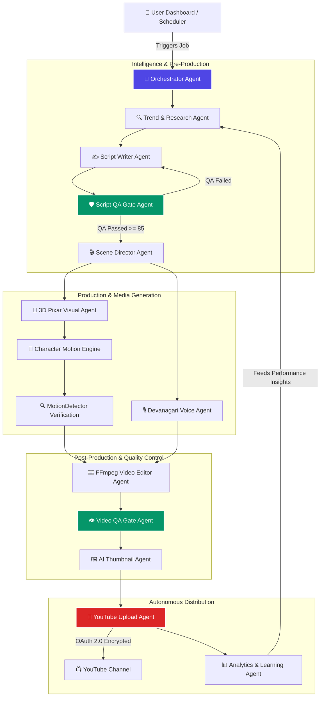

# 🚀 AutoTube AI — Autonomous YouTube Channel Studio & AI Video Production SaaS

<div align="center">


**The Hands-Free AI Engine for Scaling Profitable YouTube Channel Empires**

[](https://nextjs.org/)
[](https://fastapi.tiangolo.com/)
[](https://www.postgresql.org/)
[](https://www.python.org/)
[](https://www.docker.com/)
[](https://razorpay.com/)
[](LICENSE)

[Features](#-key-features) • [Architecture](#-system-architecture) • [Visual Workflow](#-autonomous-14-agent-pipeline) • [SaaS Plans](#-saas-pricing--unit-economics) • [Quick Start](#-quick-start) • [Deployment](#-one-click-vps-deployment)

</div>

---

## 📖 Executive Overview

**AutoTube AI** is an enterprise-grade autonomous video generation and channel management SaaS platform. It enables solo creators, digital marketers, and media agencies to launch, operate, and scale multiple automated YouTube channels without manual intervention.

From trend research and Devanagari script writing to 3D Pixar character visual generation, Hindi voiceover acting, frame-by-frame temporal motion analysis, and scheduled YouTube Data API v3 publishing — **AutoTube AI operates 24/7/365 as your autonomous digital studio crew.**

---

## 🎨 System Architecture & Visual Representation

### 🧠 Autonomous 14-Agent Orchestration Graph



---

## ✨ Key Features & Innovations

### 1. 🤖 14-Agent Autonomous Multi-Agent System
- **Research Agent:** Scrapes real-time trending topics in kids animation, moral fables, and educational content.
- **Script Writer & Script QA Gate:** Generates structured JSON scripts in Devanagari Hindi and enforces a strict quality threshold (Score ≥ 85/100).
- **Scene Director:** Breaks scripts down into frame-by-frame visual prompts, camera directions, speaker assignments, and audio cues.

### 2. 🐘 Character Bible & Visual Universe Continuity
- Persistent character registries (e.g. **Chintu the Baby Elephant**, **Momo the Monkey**, **Bholu the Bear**).
- Maintains strict 3D Pixar aesthetic consistency, color palettes, face structures, and clothing across scenes without visual drift.

### 3. 🏃 Real Character Motion & Temporal Animation Engine
- Built-in OpenCV & NumPy **`MotionDetector`** algorithm inspects generated clips frame-by-frame.
- Measures temporal pixel movement (Motion Score ≥ 0.01, Frozen Frame % ≤ 30%) to guarantee **genuine walking, running, and jumping animation** rather than static slides.

### 4. 🎙️ Emotional Devanagari Hindi Audio Synthesis
- Native EdgeTTS neural voice engine (`hi-IN-MadhurNeural`, `hi-IN-SwaraNeural`).
- Multi-speaker emotion acting with automatic background music ducking and foley sound effects.

### 5. 🛡️ Strict Multi-Tenant Data Privacy & User Isolation
- Built on **PostgreSQL 16** with `asyncpg` connection pooling.
- User accounts, YouTube channels, encrypted OAuth tokens, scripts, and videos are 100% isolated per tenant with zero cross-account leaks.

### 6. 💳 Razorpay Credit-Based Subscription Infrastructure
- Integrated Razorpay Payment Gateway supporting **UPI (GPay, PhonePe, Paytm), RuPay, Credit/Debit Cards, and Netbanking**.
- Automatic credit balance top-ups (300 / 1,000 / 3,000 Credits) and subscription tier upgrades upon payment verification.

### 7. ⚡ Self-Healing 6-Stage Checkpoint Recovery
- Durable checkpoint state machine saves execution progress after every stage (Script, Visuals, Voice, Video, QA, Upload).
- If network or power interruptions occur, jobs automatically resume from the exact last saved checkpoint without duplicating credits or assets.

---

## 💰 SaaS Pricing & Unit Economics

| Plan Name | Retail Price | Included Monthly Credits | Standard Shorts | Full Moving AI Shorts | Multi-Channel Limit | Profit Margin |
| :--- | :---: | :---: | :---: | :---: | :---: | :---: |
| **Creator Starter** | **₹999 / mo** ($12) | **300 Credits** | 30 Shorts | 6 Shorts | 1 Channel | **92.5%** |
| **Growth Pro** | **₹2,499 / mo** ($30) | **1,000 Credits** | 100 Shorts | 22 Shorts | 3 Channels | **86.0%** |
| **Studio Agency** | **₹5,999 / mo** ($72) | **3,000 Credits** | 300 Shorts | 65 Shorts | 10 Channels | **80.0%** |

---

## 🛠️ Technology Stack

| Layer | Technologies Used |
| :--- | :--- |
| **Frontend UI** | Next.js 14 (App Router), React 18, Tailwind CSS, Lucide Icons, HTML5 Canvas |
| **Backend API** | Python 3.11, FastAPI, Pydantic v2, Uvicorn |
| **Database** | PostgreSQL 16 (Async SQLAlchemy + asyncpg), SQLite3 (Development fallback) |
| **AI Models & Engines** | Google Gemini 2.5/3.5 Flash, Pollinations, FLUX.1, EdgeTTS HD Neural |
| **Video & Audio Processing** | FFmpeg 6.0+, OpenCV, NumPy, MotionDetector Engine |
| **Security & Auth** | Google OAuth 2.0, Fernet AES-128 Encryption, JWT (HS256) |
| **Payments** | Razorpay Payments API (UPI, Cards, Netbanking) |
| **Containerization & Reverse Proxy**| Docker, Docker Compose, Nginx |

---

## 💻 Local Development Setup

### 1. Prerequisites
- **Python:** 3.11 or higher
- **Node.js:** v18.0 or higher
- **FFmpeg:** Installed and added to System PATH
- **PostgreSQL:** Running locally on port 5432 (or SQLite fallback)

### 2. Clone & Configure Environment
```bash
git clone https://github.com/Mithilesh1310/AutoTube-Ai.git
cd AutoTube-Ai

# Copy sample environment configuration
cp .env.example .env
```

### 3. Run Backend (FastAPI)
```bash
# Create Python Virtual Environment
python -m venv venv
source venv/bin/activate  # On Windows: venv\Scripts\activate

# Install Dependencies
pip install -r backend/requirements.txt

# Start FastAPI Development Server
python -m uvicorn backend.main:app --port 8000 --reload
```

### 4. Run Frontend (Next.js)
```bash
cd frontend
npm install
npm run dev
```

Open **`http://localhost:3000`** in your browser.

---

## 🌐 One-Click VPS Deployment Guide

AutoTube AI includes a single-command automated deployment script for Linux VPS servers (Hostinger, DigitalOcean, BigRock, AWS EC2, Linode).

### Deploying to any Linux VPS (Ubuntu 22.04 LTS):

```bash
# Connect to your VPS via SSH
ssh root@YOUR_SERVER_IP

# Clone & Run Automated Production Deployment
git clone https://github.com/Mithilesh1310/AutoTube-Ai.git autotube
cd autotube
chmod +x deploy_vps.sh
./deploy_vps.sh
```

The deployment script automatically:
1. Installs Docker Engine & Docker Compose plugin.
2. Configures UFW firewall rules for Ports 80, 443, and 22.
3. Builds and launches **PostgreSQL 16**, **FastAPI Backend**, **Next.js Frontend**, and **Nginx Reverse Proxy**.
4. Serves your live application at `http://YOUR_SERVER_IP` (or your domain name with free SSL HTTPS via Certbot).

---

## 📜 License & Author

Distributed under the **MIT License**. See `LICENSE` for more information.

**Founder & Lead Architect:** Mithilesh Sahni ([GitHub](https://github.com/Mithilesh1310))  
**Project Repository:** [https://github.com/Mithilesh1310/AutoTube-Ai](https://github.com/Mithilesh1310/AutoTube-Ai)

---

<div align="center">
  <sub>Built with ❤️ for AI Creators and Video Automation Empires.</sub>
</div>
