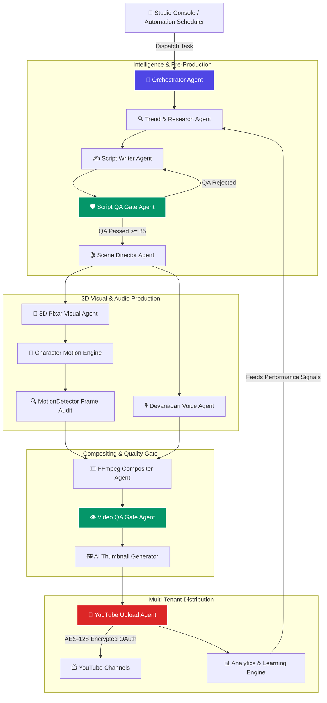

# 🚀 AutoTube AI — Autonomous Video SaaS Engine

**The Hands-Free AI Engine for Scaling Automated YouTube Channel Empires**

---

## 📖 Executive Pitch & Product Vision

**AutoTube AI** is a proprietary autonomous video production and multi-channel publishing platform built for modern creators, media networks, and automation agencies.

It transforms trend intelligence into 3D Pixar animated kids stories, emotional Devanagari Hindi voiceovers, temporal character motion verification, and daily scheduled YouTube Data API v3 uploads without manual intervention.

---

## 🧠 Autonomous 14-Agent Pipeline Graph

---

## 🌟 Proprietary Core Technologies

- **14-Agent Autonomous Graph:** End-to-end multi-agent orchestration for hands-free video creation.
- **Character Universe Continuity:** Persistent 3D Pixar character bible (Chintu the Elephant, Momo, Bholu) with zero visual drift.
- **Frame-by-Frame Motion Detector:** OpenCV/NumPy temporal movement verification guaranteeing authentic walking, jumping, and running animation.
- **Devanagari Voice Synthesis:** Neural Hindi audio acting with automatic background music ducking and foley sound effects.
- **Strict Multi-Tenant Isolation:** PostgreSQL 16 row-level tenant security and bank-grade AES-128 token encryption.
- **Razorpay Credit Engine:** Integrated UPI (GPay, PhonePe, Paytm), Netbanking, and Card subscription management.

---

## 🔒 Intellectual Property & Confidentiality

**Copyright © 2026 AutoTube AI Technologies. All Rights Reserved.**

This repository contains **proprietary commercial software**. Unauthorized copying, modification, distribution, or reverse engineering of this repository or any portion of its codebase is strictly prohibited without explicit written consent from the founder.

**Founder & Owner:** Mithilesh Sahni  
**Repository:** [https://github.com/Mithilesh1310/AutoTube-Ai](https://github.com/Mithilesh1310/AutoTube-Ai)
